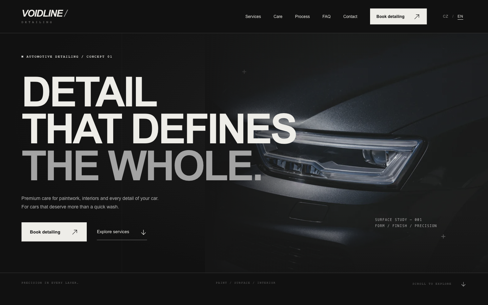
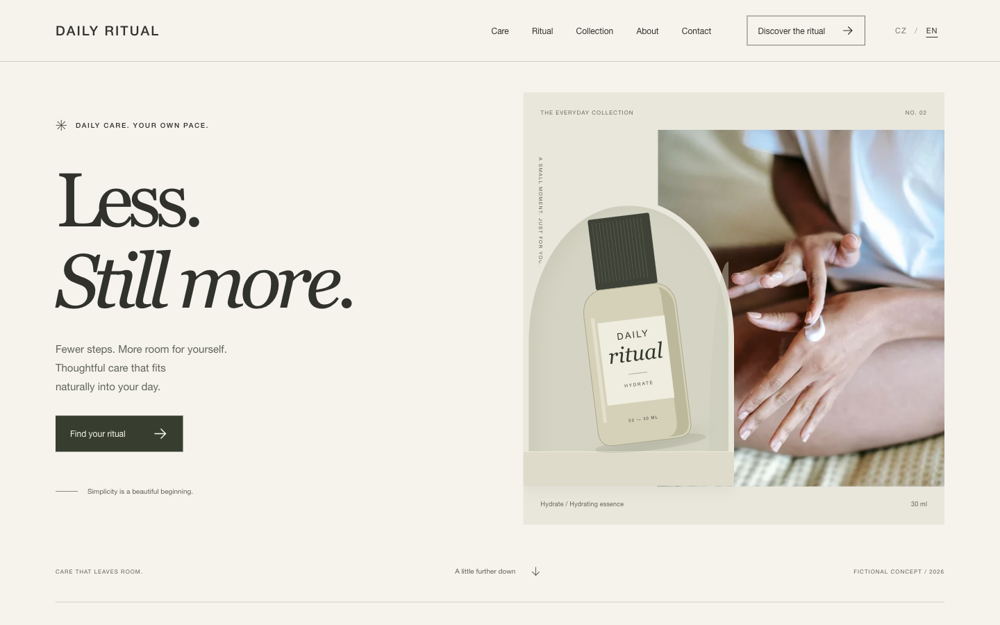
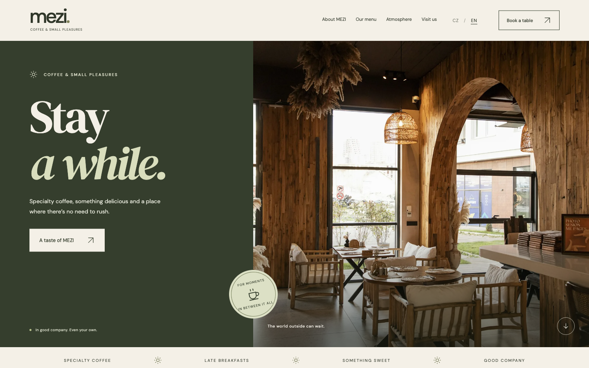

# Hi, I'm Adam Stříbný.

**Front-End Developer · Founder of VERBA Studio** 
Czech Republic

I design and build websites with a clear visual identity, responsive layouts and considered front-end implementation. I run [VERBA](https://verbastudio.cz/), a small independent web studio, and work directly with businesses and creative agencies.

My background includes a bachelor's education with a focus on Computer Science at the University of Ostrava. I use AI-assisted development as part of my workflow, alongside source review, browser testing and hands-on visual refinement.

## Selected Work

Three original portfolio concepts. Each explores a different industry and visual direction; none is presented as commissioned client work. All three include Czech and English content in one Vue application.

### VOIDLINE DETAILING

Automotive · A dark, high-contrast detailing concept with bold typography, close-up photography and a keyboard-operated surface study.

[Live — CZ](https://voidline.verbastudio.cz/) · [Live — EN](https://voidline.verbastudio.cz/en/) · [Source](https://github.com/Asmodaai/voidline-detailing)

### DAILY RITUAL

Beauty / skincare · Light editorial layouts, original packaging illustrations and a quiet, responsive interface built around everyday rituals.

[Live — CZ](https://dailyritual.verbastudio.cz/) · [Live — EN](https://dailyritual.verbastudio.cz/en/) · [Source](https://github.com/Asmodaai/daily-ritual)

### MEZI

Café / gastronomy · A warm hospitality concept with expressive type, a browsable menu, an image gallery and a front-end-only reservation demo.

[Live — CZ](https://mezi.verbastudio.cz/) · [Live — EN](https://mezi.verbastudio.cz/en/) · [Source](https://github.com/Asmodaai/mezi-cafe)

## Technologies & Workflow

**Build:** Vue.js · JavaScript · HTML5 · CSS3 · Vite 
**Delivery:** Git / GitHub · Netlify · browser QA 
**Approach:** responsive implementation, shared locale data, lightweight components and attention to keyboard interaction.

I use AI tools to support development and iteration. The published projects show the implementation, design decisions and checks behind the work.

## VERBA Studio

Landing pages, business and presentation websites, microsites and white-label front-end development.

For businesses, I work directly on the site's structure, visual direction and implementation. For agencies, I can deliver a defined front-end scope from an approved design while their creative direction and client relationship stay with them.

[VERBA — Czech](https://verbastudio.cz/) · [VERBA — English](https://verbastudio.cz/en/)

## Certifications

- **freeCodeCamp — Legacy JavaScript Algorithms and Data Structures V8** 
  Developer Certification · 2024 · [Verify](https://www.freecodecamp.org/certification/asmodaai/javascript-algorithms-and-data-structures-v8)
- **Udemy — Vue - The Complete Guide (incl. Router & Composition API)** 
  Maximilian Schwarzmüller · Certificate of Completion · 2026 · [Verify](https://ude.my/UC-bb8ad145-8a23-4bef-8443-3d82854d28be)

## Beyond Code

I'm drawn to JDM and Mitsubishi, automotive culture, music and history. Different interests, the same attention to character and detail.

## Contact

[adam@verbastudio.cz](mailto:adam@verbastudio.cz) · [verbastudio.cz](https://verbastudio.cz/)
